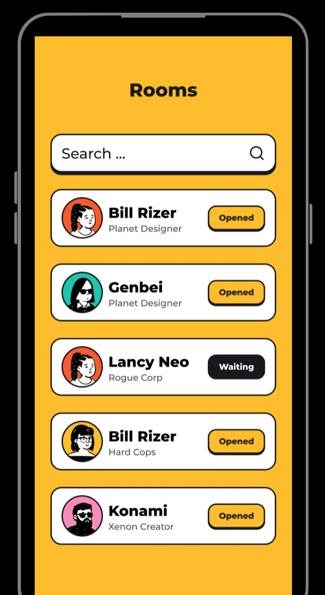

### X Memo

#### Intro

X is an animated face reaction-based messenger app. It shows you the face reaction of your friend in an animated avatar when they read/reply to your message.

---

#### Things Everyone Else Is Missing

When we share a message with our friends, seeing and feeling the reaction on their face means more than just texts, emojis, stickers. It’s human nature to sense these emotions, but it doesn’t exist in any current messenger apps.

---

#### Product Preview

Let’s say your friend Peter receives a message from you on X, when he reads/replies to the message, we will record his face reaction in the background and make it an animated avatar gif then send it back to you with the new message Peter just typed.

Once you have enough engagement then we will match new friends with you based on your face reactions to content, message.

---

#### Mission

Our mission is to build a social network that empowers people to create real emotional connections with friends in animated identities.

---

#### Why Now

The true depth camera on iOS presents a new camera-based content creation possibility and empowers us to build it on X.

---

#### Strategy to Generate Network Effect

The more messages, the users open, the more face reactions the user will create in the background.

**Emotion as the Content Loop**

The reaction to content triggers more content than the content itself.  Every reaction to message/content will trigger more reactions from other people.

It's easy to clone the tech behind X, but it's impossible to clone those ‘ reacted moments'. People won't leave X because of their 'social-emotional history' here.

**Messenger = Dating App**

We will match new friends with our users based on the reaction data.

**XMOJI = Personalized Animated Identity**

We want to create an XMOJI kit: a 3D animated avatar kit with emote features to empower users to create their own identity.

---

#### Making $ on face-reaction-based Ads

X will be one of the most accurate ad platforms for business, because we have the user data on face reactions to the content.

---

##### Full Deck: [a@xos.social](mailto:axos@social)

