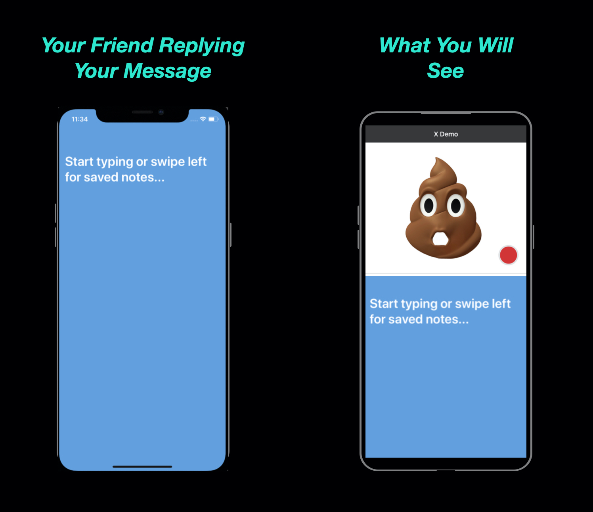

### X Memo

### Intro

X is an animated face reaction-based messenger app. It shows you the face reaction of your friend in an animated avatar when they read/reply to your message.

---

### Status

- Pre-everything: launch, user, rev, incorporation
- Status: building iOS private beta (launch: 11/15)

---

### Product Preview

**Mission**

Our mission is to build a social network that empowers people to create real emotional connections with friends in animated identities.

**Things Everyone Else Is Missing**

When we share a message with our friends, seeing and feeling the reaction on their face means more than just texts, emojis, stickers. It's human nature to sense these emotions, but it doesn’t exist in any current messenger apps.

**Why Now**

Tech Shift

X benefiting from a massive fundamental camera tech shift: Truth depth camera on iOS. The tech presents a new camera-based content creation possibility and empowers us to build it on X.

---

### The Master Plan

- Build a search engine that extracts the details from screenshots, and makes it searchable and clickable

- Invent a new way people interact with static media (Photo, PDF...)

- Build a private social network for personal digital memories

