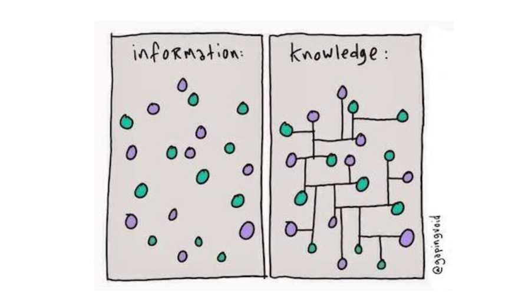
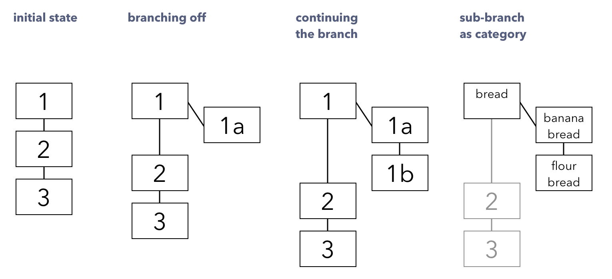

### TARS

## The Operating System for Human Knowldege

To solve the scattered knowledge graph problem in the current web, we need:

- The good knolwedge input & output system (the search engine)
- A well-structured knowledge network (interactions)

### Search Engine

**Stage1: A Search Engine for Hacker's Knowledge Base**

**Launch: 7/15**

- Upload your knowledge base (blogs, personal wiki...) to join the network
- Browse knowledge base list
- Search network-driven knowledge without noise and spam

Desktop Demo:

**[Go Landing Page](https://tarsbase.github.io/cause/)**

---

### Network

**Stage2: A Git-powered Knowledge Base Network**

**Launch: 8/15**

I believe:

- Knowledge should be structured and organized
- The key to having a valuable knowledge ecosystem is the interaction with a knowledge system that provides value, so more knowledgable people will join.

The core interaction on TARS is to iterate Knowledge branching with other hackers:

- Search network-driven knowledge
- Create / join a mission to iterate the knowledge together
- Clone other people's knowledge base to a local computer
- Annotate and comment on it then **Push** it back to the network
- Other users can choose to **Pull** the update to their branch
- **Merge** different knowledge base

---

### Vision

**Stage3: The Operating System for Human Knowldege**

**Launch: in 5 Years**

We decentralize our knowledge and intelligence to a network with a customizable personal knowledge AI, so we can digest and iterate knowledge faster, deeper.

---

### Why Me?

I'm a heavy user of the personal knowledge base. I have been iterating my own [knowledge base](https://github.com/allenleein/knowledge-base) on Github for 2 years.

One of my post from knowledge base got on **front page of Hacker News and got 16K+ page views** in 2 days.

---

Feel free to [DM me](https://twitter.com/allenleein) or [Email me](mailto:allenleein@gmail.com)

