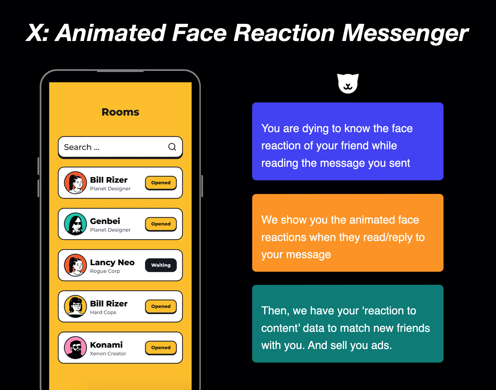
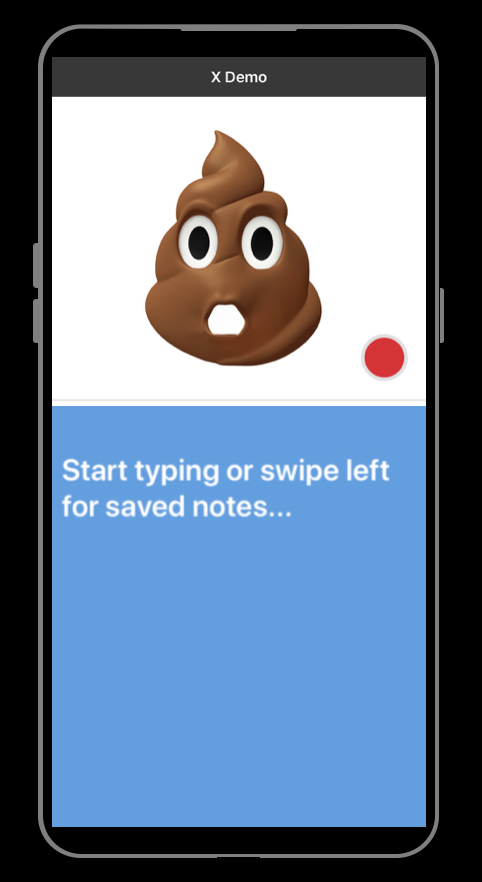
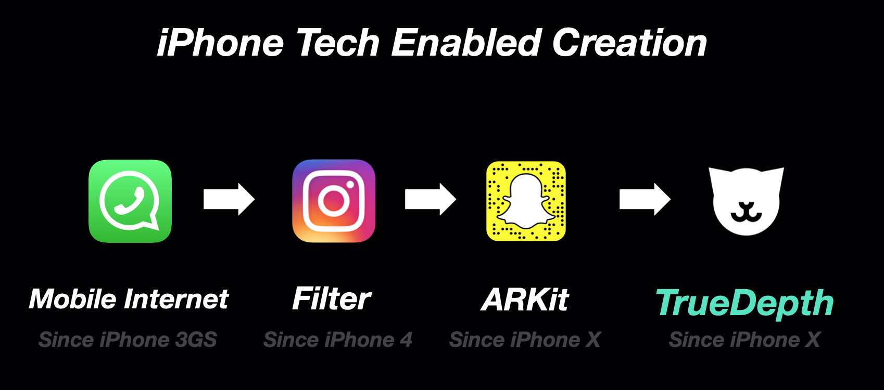

### X Memo

#### Product Preview

X is an animated face reaction-based messenger app. It shows you the face reaction of your friend in an animated avatar when they read/reply to your message.

- Status: building iOS private beta (launch: 11/15)

---

#### Mission

Our mission is to build a social network that empowers people to create real emotional connections with friends in animated identities.

---

#### Why Now

---

#### Why X

When we share a message with our friends, seeing and feeling the reaction on their face means more than just texts, emojis, stickers. It's human nature to sense these emotions, but it doesn’t exist in any current messenger apps.

That’s why I want to make a new behavioral paradigm in social apps that make people connected emotionally.

---

##### Full Deck: [a@xos.social](mailto:axos@social)

