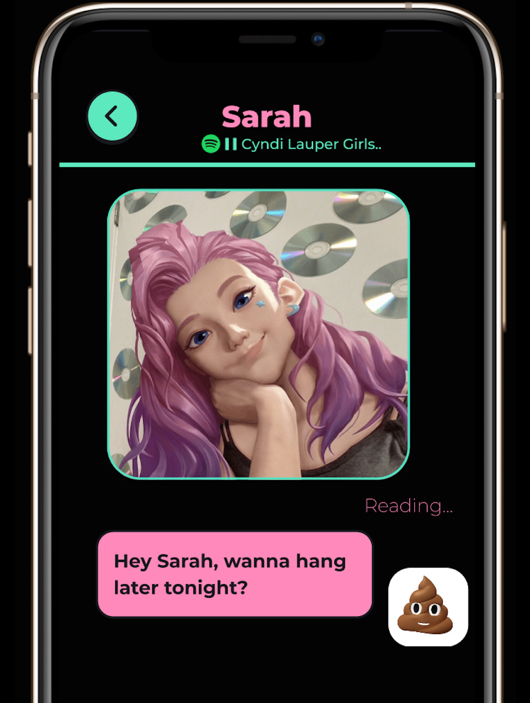

#### X 

#### Mission

Our mission is to build a virtual network that empowers people to create real emotional connections with friends in automated animated identities. Like Ready Player One with AI.

---

#### How We Think and Operate

**Exponential Value, Not Valuation**

The question we ask ourselves on every product decision is 'Would this lead to a 10X-100X increase in the value of our product or business' Then we focus on it.

We don't talk or promote anything related to the company valuation, funding news.

**Focus on the Upside**

Evaluate

- Pursue the highest upside first, calculate the resources to make it happen later.
- Pursue 100% clarity of thinking.

Execute

- Find the secrets that would help us win faster and bigger. (solving the picture of the puzzle faster, not putting the pieces together faster)

#### We Want to Change the Game

Most product and distribution roadmaps are incremental. Do x, then y, then z, each of which has a linear increase in the value of the product or company. In our way, we get out of that way of thinking and ask what sorts of strategies, adoptions, or customers would completely change the game for the company.

For example, in an environment where competition is more intense than ever, successful start-ups are achieving scale faster than they have ever before. WhatsApp achieved 1BN Monthly active users in seven years, Messenger achieved this in 4 years and Pokémon Go became the fastest growing app in history in 2016 becoming bigger than Twitter in just a few weeks. (Let alone TikTok in 2020)

Growth records are being beaten every single year. The trend is set to continue and the need for entrepreneurs to find growth from the outset is more important and valuable than ever. Ultimately it’s a “user experience and liquidity” problem, and the goal is to make the product experience so good that enable us to scale without spending a fortune on sales and marketing. Taking advantage of a market insight or new platform before an incumbent is able to react.

That’s why we build MDP, not MVP. We bend the future, not discover It.

---

#### Unpopular Minds Create Unpopular Ideas

We're looking for design and engineering generalists who are obsessed with unpopular thinking. You will be critical in setting the product vision and defining the team culture. We’re reserving a large chunk of equity so that our team feels like a true owner and co-creator of this company.

---

*Feel free to reach out anytime: [allen@readyplayerx.com](mailto:allen@readyplayerx.com)*

