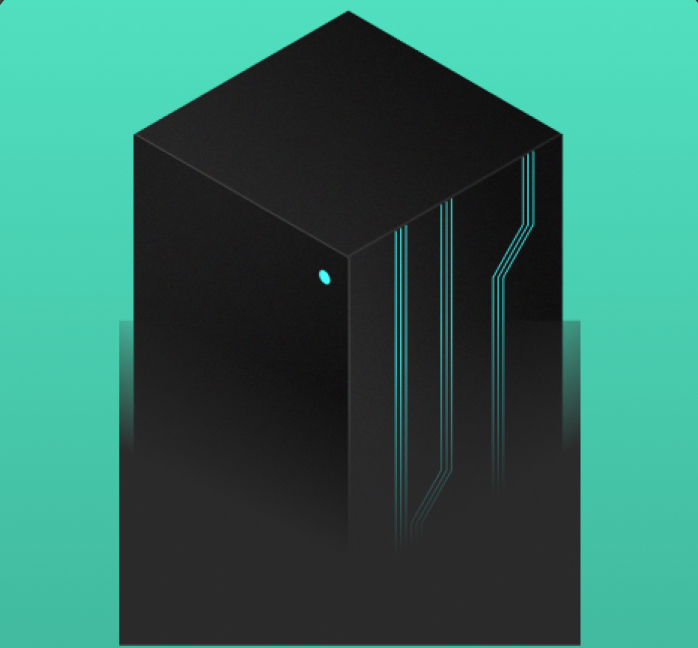

## A Network of Brains

Inspired by Ghost in the Shell (攻殻機動隊 シェルのゴースト), I believe the future of human minds is to decentralize ourselves to a knowledge network. We push our brains into a composable thinking network, iterate our minds together.

